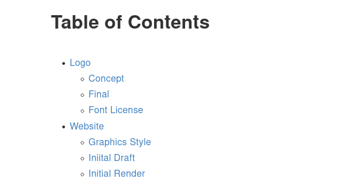

# gitbook-plugin-toc

This plugin will add table of content to the page and provide navigation function inside a page.

Add `<!-- toc -->` to the markdown files. When you build the book, it will insert a table of content where you insert `<!-- toc -->`. To automatically generate a table of content for every page without adding `<!-- toc -->`, set the `auto` option to `true`.

## Preview


## `book.json` Configuration Examples

**Add a custom class to the TOC `ul` element:**

```
{
	"plugins": ["toc"],
	"pluginsConfig": {
		"toc": {
			"addClass": true,
			"className": "toc"
		}
	}
}
```

You can add this config to add a HTML ClassName to the TOC `ul` element

**Automatically generate TOC for every page**

```
{
	"plugins": ["toc"],
	"pluginsConfig": {
		"toc": {
			"auto": true
		}
	}
}
```

**Add title to generated TOC**



```
{
	"plugins": ["toc"],
	"pluginsConfig": {
		"toc": {
			"title": "Table of Contents",
			"addTitleClass": "toc-title"
		}
	}
}
```

In this example, `addTitleClass` is used for the HTML ClassName for the `h1` element used for the title.